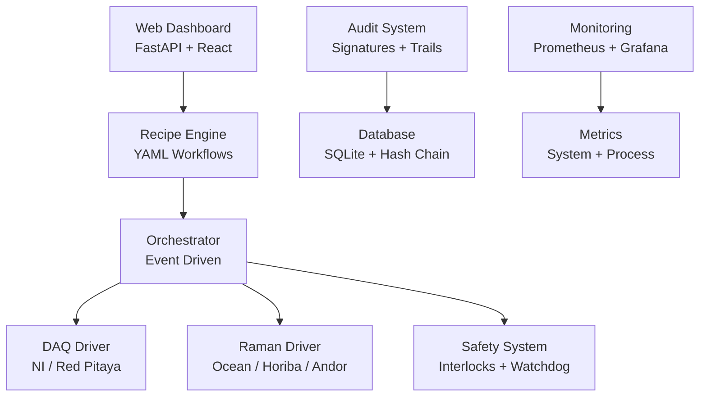

# 🔬 POLYMORPH-4 Lite: Unified Retrofit Control + Raman‑Gating Kit

[](https://opensource.org/licenses/MIT)
[](https://www.python.org/downloads/)
[](https://fastapi.tiangolo.com/)
[](https://www.docker.com/)

> **Complete unified build** integrating Retrofit Kit v4, Hardware Wizard v6, and Config Overlays v6 into a single production-ready system for analytical instrument automation with 21 CFR Part 11 compliance.

## 🎯 What is POLYMORPH-4 Lite?

POLYMORPH-4 Lite is a comprehensive **retrofit control system** that adds modern automation, safety, and compliance features to existing analytical instruments. It provides:

- **🔄 Real-time Raman spectroscopy** integration with conditional gating
- **⚡ Multi-vendor hardware support** (National Instruments, Red Pitaya, Ocean Optics, Horiba, Andor)  
- **🛡️ Safety interlocks** and monitoring systems
- **📋 21 CFR Part 11 compliance** with audit trails and e-signatures
- **🚀 Recipe-based automation** with YAML workflows
- **📊 Production observability** (Prometheus + Grafana)

---

## 🚀 Quick Start

### ⚡ One-Command Setup
```bash
git clone https://github.com/dawsonblock/POLYMORPH_Lite.git
cd POLYMORPH_Lite
python scripts/unified_cli.py quickstart
```

### 🐳 Docker Deployment
```bash
git clone https://github.com/dawsonblock/POLYMORPH_Lite.git
cd POLYMORPH_Lite
python scripts/deploy.py prod
```

**Access Points:**
- 🌐 **Dashboard**: http://localhost:8000
- 📚 **API Docs**: http://localhost:8000/docs
- 📊 **Grafana**: http://localhost:3000 (admin/admin)

---

## 📦 What's Included

### **Unified Components**
| Component | Version | Description |
|-----------|---------|-------------|
| **🔧 Retrofit Kit** | v4 | Core system with full vendor support |
| **🎛️ Hardware Wizard** | v6 | Automatic device detection & configuration |
| **⚙️ Config Overlays** | v6 | Pre-built hardware configurations |
| **💻 Unified CLI** | v1.0 | Integrated command interface |
| **📦 Installation System** | v1.0 | Automated setup & deployment |
| **🐳 Production Configs** | v1.0 | Docker, nginx, observability |

### **Ready-to-Use Hardware Configurations**

Apply tested combinations instantly:

```bash
# NI USB-6343 + Ocean Optics spectrometer
python scripts/unified_cli.py config overlay NI_USB6343_Ocean0

# NI PCIe-6363 + Horiba spectrometer  
python scripts/unified_cli.py config overlay NI_PCIE6363_Horiba

# Red Pitaya + Andor camera
python scripts/unified_cli.py config overlay RedPitaya_Andor

# NI USB-6343 + software simulator (no hardware needed)
python scripts/unified_cli.py config overlay NI_USB6343_Simulator
```

---

## 🏗️ Architecture Overview



---

## 🔧 Hardware Support

### **Data Acquisition (DAQ)**
- **National Instruments**: USB-6343, PCIe-6363, PXI-6733
- **Red Pitaya**: Network-connected SCPI/TCP devices  
- **Simulator**: Software-only testing (no hardware required)

### **Raman Spectrometers**
- **Ocean Optics**: USB spectrometers via SeaBreeze library
- **Horiba**: Spectrometers via vendor SDK
- **Andor**: Camera-based systems via vendor SDK
- **Simulator**: Built-in spectral simulation

### **Safety I/O**
- **Digital Inputs**: E-stop, door interlocks, sensor monitoring
- **Digital Outputs**: Watchdog signals, status indicators
- **Configurable Logic**: AND/OR conditions, timeouts, failsafe modes

---

## 📋 Installation Options

### **Option 1: Interactive Setup (Recommended)**
```bash
# Complete guided setup with hardware detection
python install.py --full-setup
```

### **Option 2: Unified CLI Wizard**
```bash
# Modern CLI-based setup
python scripts/unified_cli.py quickstart
```

### **Option 3: Step-by-Step Manual**
```bash
# Install dependencies
python install.py --hardware

# Configure hardware automatically
python scripts/unified_cli.py hardware wizard

# Apply configuration overlay
python scripts/unified_cli.py config overlay NI_USB6343_Ocean0

# Start server
python scripts/unified_cli.py server
```

### **Option 4: Docker Deployment**
```bash
# Development environment
python scripts/deploy.py dev

# Production with observability
python scripts/deploy.py prod

# Hardware-enabled container
python scripts/deploy.py hardware
```

---

## 🧪 Recipe Automation

### **Recipe Example**
```yaml
name: "Crystallization Monitoring"
description: "Monitor crystallization process with Raman gating"

steps:
  - type: bias_set
    voltage: 2.5
    description: "Set bias voltage for process start"
    
  - type: hold
    duration: 30
    description: "Initial equilibration period"
    
  - type: wait_for_raman
    condition:
      type: peak_threshold
      line_nm: 532.0
      threshold: 1500.0
      direction: "above"
    timeout: 3600
    description: "Wait for crystallization peak"
    
  - type: gate_stop
    reason: "Crystallization detected"
    description: "Stop process when crystal forms"
```

### **Gating Conditions**
- **📊 Peak Threshold**: Stop when intensity reaches target at specific wavelength
- **📈 Slope Detection**: Monitor rate of change over time window
- **🎯 Ratio Gating**: Two-line intensity ratio monitoring  
- **📉 Spectral Divergence**: Statistical comparison to reference spectrum

---

## 🛡️ Safety & Compliance

### **Safety Features**
- **🛑 E-stop Integration**: Hardware emergency stop via digital inputs
- **🚪 Door Interlocks**: Configurable door/enclosure monitoring
- **⏱️ Watchdog Timers**: Automatic fault detection and recovery
- **🔒 Failsafe Logic**: Safe shutdown on any safety violation

### **21 CFR Part 11 Compliance**
- **📝 Audit Trails**: Cryptographically secured, append-only records
- **✍️ Electronic Signatures**: RSA-based signature verification
- **👥 Role-Based Access**: Operator, Engineer, QA, Admin roles
- **🔐 Two-Person Signoff**: Configurable approval workflows
- **🔑 Password Policies**: Enforced complexity and expiration

---

## 📊 Observability & Monitoring

### **Built-in Metrics**
- **⚡ System Performance**: CPU, memory, disk usage
- **🔬 Process Metrics**: Recipe execution, gating events
- **🛠️ Hardware Status**: DAQ channels, Raman connectivity
- **👥 User Activity**: Login events, recipe executions

### **Monitoring Stack**
```bash
# Start with full observability
python scripts/deploy.py prod

# Access monitoring
open http://localhost:3000  # Grafana dashboards
open http://localhost:9090  # Prometheus metrics
```

### **Real-time Dashboards**
- **📈 System Health**: Live status and performance charts
- **🔬 Process Monitoring**: Active recipes and gating conditions  
- **⚠️ Alerts**: Configurable thresholds and notifications
- **📊 Historical Analysis**: Long-term trend analysis

---

## 🎛️ Command Line Interface

The unified CLI provides integrated access to all system functions:

### **Main Commands**
```bash
python scripts/unified_cli.py quickstart        # Interactive setup wizard
python scripts/unified_cli.py server            # Start development server
python scripts/unified_cli.py system status     # Show system health
```

### **Hardware Management**
```bash
python scripts/unified_cli.py hardware list     # List detected devices
python scripts/unified_cli.py hardware wizard   # Auto-configure hardware
python scripts/unified_cli.py hardware profile ni_usb_6343  # Apply profile
```

### **Configuration Management**
```bash
python scripts/unified_cli.py config list       # Show available overlays
python scripts/unified_cli.py config overlay NI_USB6343_Ocean0  # Apply config
```

### **System Administration**
```bash
python scripts/unified_cli.py system init       # Initialize database
python scripts/unified_cli.py system logs       # View application logs
python scripts/unified_cli.py system logs -f    # Follow logs in real-time
```

---

## 🚀 Deployment Guide

### **Development Deployment**
```bash
# Quick development setup
python scripts/deploy.py dev

# With hardware support  
python scripts/deploy.py hardware
```

### **Production Deployment**
```bash
# Full production stack with monitoring
python scripts/deploy.py prod

# Configure environment
cp docker/.env.example docker/.env
# Edit docker/.env with your settings

# Deploy with custom configuration  
docker compose -f docker/docker-compose.yml \
               -f docker/docker-compose.prod.yml \
               -f docker/docker-compose.observability.yml up -d
```

### **Production Features**
- **🔒 SSL/TLS termination** via nginx reverse proxy
- **⚡ Load balancing** and rate limiting
- **📊 Full observability** with Prometheus + Grafana
- **🔄 Health checks** and automatic restarts
- **💾 Persistent storage** for data and configuration

---

## 📚 Documentation

| Document | Description |
|----------|-------------|
| 📖 **README.md** | This comprehensive overview |
| 🚀 **[QUICKSTART.md](docs/QUICKSTART.md)** | Step-by-step setup guide |
| ⚙️ **[INSTALLATION.md](docs/INSTALLATION.md)** | Detailed installation instructions |
| 🔧 **[Hardware Wizard](docs/README_wizard.md)** | Hardware detection guide |
| ⚙️ **[Config Overlays](docs/README_overlays.md)** | Configuration overlay guide |
| 📋 **[Validation](docs/validation/)** | IQ/OQ/PQ templates |
| 📄 **[VERSION.md](VERSION.md)** | Complete build information |

---

## 🎯 Use Cases

### **🔬 Research & Development**
- **Automated spectroscopy** workflows with conditional stopping
- **Real-time process monitoring** during synthesis reactions  
- **Data integrity** and traceability for publications
- **Rapid prototyping** with simulation modes

### **🏭 Quality Control**
- **Batch release testing** with electronic records
- **Multi-user workflows** with approval chains
- **Compliance documentation** for regulatory submissions
- **Automated pass/fail** criteria with gating

### **⚗️ Process Development**  
- **Scale-up monitoring** from lab to pilot plant
- **Process optimization** with automated DOE
- **Critical parameter** monitoring and control
- **Technology transfer** documentation

### **🏥 Production Integration**
- **Retrofit existing** analytical instruments
- **LIMS/MES integration** via RESTful API
- **Real-time release** testing and documentation
- **Regulatory compliance** (FDA, EMA, ICH)

---

## 📋 System Requirements

### **Software Requirements**
- **Python**: 3.11 or later
- **Operating System**: Windows 10/11, Ubuntu 20.04+, macOS 10.15+
- **Memory**: 4GB RAM minimum, 8GB recommended
- **Storage**: 2GB free disk space minimum

### **Hardware Drivers (Optional)**
```bash
# National Instruments
# Download NI-DAQmx Runtime from ni.com
pip install nidaqmx

# Ocean Optics  
pip install seabreeze

# Vendor SDKs (contact vendors for licensing)
# - Horiba SDK
# - Andor SDK
```

### **Network Requirements**
- **Internet**: Required for initial setup and Docker images
- **Local Network**: For Red Pitaya devices and remote monitoring
- **Ports**: 8000 (main app), 3000 (Grafana), 9090 (Prometheus)

---

## 🤝 Contributing

We welcome contributions! Here's how to get started:

### **Development Setup**
```bash
# Fork and clone the repository
git clone https://github.com/yourusername/POLYMORPH_Lite.git
cd POLYMORPH_Lite

# Set up development environment
python -m venv .venv
source .venv/bin/activate  # Linux/Mac
# .venv\Scripts\activate   # Windows

# Install dependencies
pip install -r requirements.txt -r requirements-hw.txt

# Install development tools
pip install pytest pytest-cov black flake8 mypy

# Run tests
python -m pytest tests/
```

### **Contribution Guidelines**
- 🐛 **Bug Reports**: Use GitHub issues with detailed reproduction steps
- ✨ **Feature Requests**: Describe use case and proposed implementation  
- 🔧 **Pull Requests**: Follow existing code style and include tests
- 📚 **Documentation**: Update docs for any API or configuration changes

---

## 🆘 Troubleshooting

### **Common Issues**

#### **Hardware Not Detected**
```bash
# Check hardware status
python scripts/unified_cli.py hardware list

# Re-run hardware wizard
python scripts/unified_cli.py hardware wizard

# Check drivers (Windows)
# Ensure NI-DAQmx Runtime is installed

# Check permissions (Linux)
sudo usermod -a -G dialout $USER  # For USB devices
```

#### **Server Won't Start**
```bash
# Check system status
python scripts/unified_cli.py system status

# View detailed logs
python scripts/unified_cli.py system logs

# Check port availability
lsof -i :8000  # Linux/Mac
netstat -an | findstr :8000  # Windows
```

#### **Database Issues**
```bash
# Reinitialize system
rm -f data/audit.db
python scripts/unified_cli.py system init
```

### **Getting Help**
1. 📚 Check the [documentation](docs/)
2. 🔍 Search [existing issues](https://github.com/dawsonblock/POLYMORPH_Lite/issues)
3. 🐛 [Create new issue](https://github.com/dawsonblock/POLYMORPH_Lite/issues/new) with details
4. 💬 Use CLI help: `python scripts/unified_cli.py --help`

---

## 📈 Roadmap

### **Upcoming Features**
- [ ] 🌐 **Web-based recipe editor** with drag-and-drop interface
- [ ] 📱 **Mobile dashboard** for remote monitoring
- [ ] 🔌 **Additional hardware vendors** (Thermo, Agilent, etc.)
- [ ] 🤖 **Machine learning** integration for predictive gating
- [ ] ☁️ **Cloud deployment** options (AWS, Azure, GCP)
- [ ] 📊 **Advanced analytics** and reporting

### **Version History**
- **v1.0** (2025-09-08): Initial unified build release
- **v4** (Base): Latest Retrofit Kit with full vendor support
- **v6** (Addons): Hardware Wizard and Config Overlays

---

## ⚖️ License & Compliance

### **License**
This project is licensed under the MIT License - see the [LICENSE](LICENSE) file for details.

### **Compliance Notice**
> ⚠️ **Important**: This software includes mechanisms supporting 21 CFR Part 11-style controls (audit trail, e-signatures, authority checks). **Certification and validation are the operator's responsibility.** Safety (SIL-3) is addressed as an engineering pattern; actual certification requires accredited assessment and hardware selection.

### **Third-Party Licenses**
- **FastAPI**: MIT License
- **SQLAlchemy**: MIT License  
- **Prometheus**: Apache 2.0 License
- **Grafana**: AGPLv3 License

---

## 🏆 Acknowledgments

- **Aetheron Research** for the original template and architecture
- **FastAPI** community for the excellent web framework
- **Scientific Python** ecosystem (NumPy, SciPy, Pandas)
- **Hardware vendors** (NI, Ocean Optics, Horiba, Andor) for SDK support
- **Open source community** for tools and libraries

---

## 📞 Support

### **Enterprise Support**
For enterprise deployments, validation assistance, and custom integrations:
- 📧 **Email**: support@polymorph4.com  
- 🌐 **Website**: https://polymorph4.com
- 📞 **Phone**: Available for enterprise customers

### **Community Support**  
- 💬 **GitHub Issues**: https://github.com/dawsonblock/POLYMORPH_Lite/issues
- 📚 **Documentation**: Complete guides included in `docs/`
- 🔧 **CLI Help**: `python scripts/unified_cli.py --help`

---

<div align="center">

### 🎯 Ready to Transform Your Analytical Workflow?

```bash
git clone https://github.com/dawsonblock/POLYMORPH_Lite.git
cd POLYMORPH_Lite  
python scripts/unified_cli.py quickstart
```

**⭐ Star this repo** if POLYMORPH-4 Lite helps your research!

---

**Built with ❤️ for the scientific community**

</div>