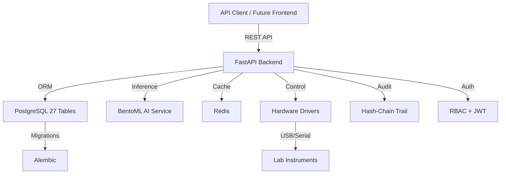

<div align="center">


# 🔬 POLYMORPH-LITE (v3.2 Production Ready)

**Status**: 🟢 **Production Ready** | **Tier-1 Stack**: NI DAQ + Ocean Optics | **Architecture**: PostgreSQL | RBAC | 21 CFR Part 11–Aligned

[](https://github.com/dawsonblock/POLYMORPH_LITE_MAIN/releases)
[](https://opensource.org/licenses/MIT)
[](https://www.python.org/downloads/)
[](https://fastapi.tiangolo.com/)
[](https://www.postgresql.org/)
[](https://www.docker.com/)
[](#)

[🚀 Quick Start](#-quick-start) • [✨ Features](#-key-features) • [📖 Documentation](#-documentation) • [🏗️ Architecture](#-architecture) • [🤝 Contributing](#-contributing)

---

</div>

## 🎯 Overview

POLYMORPH-LITE transforms legacy analytical instruments into intelligent, AI-powered laboratory systems. Built for pharmaceutical R&D, quality control, and GMP environments with enterprise-grade database architecture and 21 CFR Part 11–aligned compliance features.

### 🆕 What's New in v3.2 (Production Ready)

<table>
<tr>
<td width="50%">

**☁️ Cloud Native**
- **Terraform**: Modular AWS infrastructure (VPC, EKS, RDS)
- **Kubernetes**: Production-grade manifests with GPU support
- **CI/CD**: Automated build & deploy pipelines

</td>
<td width="50%">

**📜 Compliance Suite**
- **21 CFR Part 11**: IQ/OQ/PQ templates & SOPs
- **Validation**: Generated risk assessments & reports
- **Audit**: Cryptographic audit trails

</td>
</tr>
<tr>
<td>

**🖥️ Operator UI**
- **Wizard**: Guided experiment execution
- **Real-Time**: Live spectral visualization
- **Reporting**: PDF export & auto-save

</td>
<td>

**🧠 Concrete AI**
- **RamanCNN**: PyTorch model for spectral analysis
- **Training**: Synthetic data generation & training scripts
- **Serving**: BentoML with retraining endpoints

</td>
</tr>
</table>

### ⚙️ Backend Modernization (Pydantic v2 & Timezones)
- Pydantic models migrated to v2 (`ConfigDict`, `model_config`, `model_dump()`).
- Backend timestamps are now timezone-aware UTC (`datetime.now(timezone.utc)` via helpers).
- **Unified Session Management**: All API endpoints and core components now use `Depends(get_db)` and `SessionLocal` for consistent, thread-safe database access. Deprecated `get_session` patterns have been removed.
- Device registry uses explicit keys for DAQ and Raman simulators to avoid name collisions.
- Hardware-dependent tests are marked with `pytest.mark.hardware` and are skipped by default unless explicitly enabled.

---

## ✨ Key Features

### 🗄️ Database & Data Management
- **27-Table Schema**: Comprehensive data model for lab operations
- **PostgreSQL-First**: Enterprise database with ACID compliance
- **Alembic Migrations**: Version-controlled schema evolution
- **Sample Lineage**: Parent-child tracking for traceability
- **Inventory Control**: Stock management with expiration tracking

### 3. Workflow Engine
- **Linear Execution**: Supports sequential execution of steps (Action, Wait, Hold).
- **Note**: As of v3.2, the workflow engine supports linear sequences only. Loops and conditional branching are planned for v3.3+.
- **Visual Builder**: ⚠️ Planned for v3.3 - Currently workflow definitions via YAML.
- **Safety Integration**: Pre-execution safety checks and runtime monitoring.
- **Operator Wizard**: ⚠️ In Development - Basic execution interface available.

### 🤖 AI Integration
- **BentoML Inference**: Optimized AI model serving
- **RamanCNN**: 1D CNN for spectral concentration analysis
- **Real-Time Analysis**: <50ms inference latency
- **Auto-Detection**: Crystallization event recognition

### 🔒 Compliance & Audit

**Architecture Designed for 21 CFR Part 11 Compliance**

POLYMORPH-LITE provides technical features that support 21 CFR Part 11 requirements:
- ✅ **Hash-Chain Audit Trail**: Immutable, cryptographically verified audit logs
- ✅ **Unique User Logins**: Individual accounts with MFA support
- ✅ **Role-Based Access Control**: Granular permissions (admin, scientist, technician, compliance)
- ✅ **Electronic Signatures**: RSA-based cryptographic signatures
- ✅ **Workflow Approval & Versioning**: Locked, approved workflow definitions  
- ✅ **Password Security**: History tracking, complexity requirements, account locking

> **Note on Compliance**: Final 21 CFR Part 11 compliance requires lab-specific validation 
> (IQ/OQ/PQ), written SOPs, organizational policies, and procedures. This software provides 
> the technical foundation to support compliant operations when properly validated and deployed  
> according to your organization's quality system.

### 🎨 Modern Interface
- **Next.js + React 18**: ⚠️ In Development - Basic UI scaffolding in place.
- **Operator Wizard**: ⚠️ Planned - Backend API ready, frontend in progress.
- **Real-Time Charts**: ⚠️ Planned - WebSocket infrastructure ready.


---

## 🚀 Quick Start

### One-Command Deployment

```bash
# Clone repository
git clone https://github.com/dawsonblock/POLYMORPH_LITE_MAIN.git
cd POLYMORPH_LITE_MAIN

# Configure environment
cp .env.example .env
# Edit .env: Set POSTGRES_PASSWORD, SECRET_KEY, JWT_SECRET_KEY

# Deploy (migrations run automatically!)
docker-compose up -d

# Create admin user
docker-compose exec backend python scripts/create_admin_user.py

# Access system API docs
open http://localhost:8001/docs
```

**Default Login**: `admin@polymorph.local` / `admin123`

⚠️ **SECURITY WARNING**: Change default credentials immediately in production:
```bash
docker-compose exec backend python scripts/create_admin_user.py --email your@email.com --password YourSecurePassword123!
```

### Verification

```bash
# Check database health
docker-compose exec backend python scripts/check_db_health.py

# View logs
docker-compose logs -f backend

# API health check
curl http://localhost:8001/health
```

---

## 📊 Architecture



### Database Schema (27 Tables)

| Domain | Tables | Purpose |
|--------|--------|---------|
| **Multi-Site** | organizations, labs, nodes, device_hubs | Enterprise deployment |
| **Auth & RBAC** | users, roles, user_roles | Authentication & permissions |
| **Audit** | audit | Immutable audit trail |
| **Devices** | devices, device_status | Instrument management |
| **LIMS** | projects, batches, containers, samples, sample_lineage | Sample tracking |
| **Inventory** | vendors, inventory_items, stock_lots | Stock management |
| **Calibration** | calibration_entries | Instrument calibration |
| **Workflows** | workflow_versions, executions, assignments, config_snapshots | Workflow management |

---

## 🔐 RBAC & Permissions

| Role | Create | Read | Update | Delete | Use Case |
|------|--------|------|--------|--------|----------|
| **admin** | ✅ All | ✅ All | ✅ All | ✅ All | System administrators |
| **scientist** | ✅ Workflows, Samples | ✅ All | ✅ Own data | ❌ | Research scientists |
| **technician** | ✅ Runs, Inventory | ✅ Workflows, Samples | ✅ Inventory | ❌ | Lab technicians |
| **compliance** | ❌ | ✅ Audit, Runs | ❌ | ❌ | QA/QC officers |

---

## 📝 API Examples

### Authentication
```bash
curl -X POST http://localhost:8001/auth/login \
  -H "Content-Type: application/json" \
  -d '{"email":"admin@polymorph.local","password":"admin123"}'
```

### Create Sample (LIMS)
```bash
curl -X POST http://localhost:8001/api/samples \
  -H "Authorization: Bearer $TOKEN" \
  -H "Content-Type: application/json" \
  -d '{
    "sample_id": "SAMPLE-001",
    "status": "active",
    "extra_data": {"concentration": "10mg/mL"}
  }'
```

### Check Low Stock (Inventory)
```bash
curl http://localhost:8001/api/inventory/low-stock \
  -H "Authorization: Bearer $TOKEN"
```

---

## 🔧 Production Tools

### Database Management
```bash
# Health check
python scripts/check_db_health.py

# Backup database
python scripts/backup_database.py

# Create admin user
python scripts/create_admin_user.py --email admin@lab.com

# Generate cryptographic keys
python scripts/generate_keys.py
```

### Monitoring
- **Health Endpoint**: `/health`
- **API Documentation**: `/docs` (Swagger UI)
- **Metrics**: Prometheus-compatible (optional)

---

## 📖 Documentation

| Document | Description |
|----------|-------------|
| [README.md](README.md) | This file - overview and quick start |
| [RELEASE_NOTES.md](RELEASE_NOTES.md) | Version history and breaking changes |
| [DEPLOYMENT_GUIDE.md](DEPLOYMENT_GUIDE.md) | Production deployment instructions |
| [STRUCTURE.md](STRUCTURE.md) | Repository organization guide |
| [SECURITY.md](SECURITY.md) | Security policies and reporting |
| [TESTING.md](TESTING.md) | Testing guide and coverage |
| [docs/API_DOCUMENTATION.md](docs/API_DOCUMENTATION.md) | Complete API reference |
| [docs/USER_MANUAL.md](docs/USER_MANUAL.md) | End-user guide |

---

## 🏗️ Technology Stack

### Backend
- **FastAPI** - High-performance async API framework
- **PostgreSQL 15** - Enterprise-grade database
- **SQLAlchemy 2.0** - Modern ORM with type hints
- **Alembic** - Database migration management
- **Pydantic v2** - Data validation
- **BentoML** - AI model serving

### Frontend (Planned v3.1)
- **React 18**
- **Vite**
- **TypeScript**
- **Socket.IO**

### DevOps
- **Docker & Docker Compose** - Containerization
- **Nginx** - Reverse proxy
- **Redis** - Caching and pub/sub

---

## 🧪 Supported Hardware

- **NI DAQ** - National Instruments data acquisition
- **Ocean Optics** - Spectrometers
- **Horiba Raman** - Raman spectroscopy
- **Red Pitaya** - Signal processing
- **Custom Devices** - Modular driver architecture

---

## 📦 Requirements

### Minimum System Requirements
- **OS**: Linux, macOS, Windows (WSL2)
- **RAM**: 4GB minimum, 8GB recommended
- **Storage**: 10GB available space
- **Docker**: 20.10+
- **Docker Compose**: 2.0+

### For Development
- **Python**: 3.11+
- **Node.js**: 18+
- **PostgreSQL**: 15+ (if not using Docker)

---

## 🛣️ Roadmap

### ✅ v3.2 (Current - Production Backend Ready)
- **Hardware**: Real drivers (NI/Ocean Optics) with simulation fallback ✅
- **Infrastructure**: Terraform + Kubernetes + CI/CD ✅
- **Compliance**: Part 11 Documentation Suite (IQ/OQ/PQ) ✅
- **Backend API**: Complete REST API with RBAC & Audit ✅
- **UI**: ⚠️ In Development - Basic scaffolding
- **AI**: BentoML service with model serving ✅

### 🔄 v3.3 (Next)
- [ ] Multi-tenant organization features
- [ ] Advanced analytics dashboards
- [ ] Mobile app for lab monitoring

### 🔮 Future
- [ ] SSO integration (SAML, OAuth)
- [ ] Cloud deployment guides (AWS, Azure, GCP)

---

## 🤝 Contributing

Contributions are welcome! Please see [CONTRIBUTING.md](docs/CONTRIBUTING.md) for guidelines.

### Development Setup
```bash
# Clone repository
git clone https://github.com/dawsonblock/POLYMORPH_LITE_MAIN.git
cd POLYMORPH_LITE_MAIN

# Install dependencies
pip install -r requirements.txt
pip install -r requirements-dev.txt

# Start PostgreSQL
docker-compose up -d postgres

# Run migrations
alembic upgrade head

# Start development server
uvicorn retrofitkit.api.server:app --reload
```

---

## 📄 License

This project is licensed under the MIT License - see the [LICENSE](LICENSE) file for details.

---

## 🙏 Acknowledgments

- Built with ❤️ for the pharmaceutical and research community
- Powered by FastAPI, React, PostgreSQL, and BentoML
- Inspired by real-world lab automation challenges

---

## 📧 Support

- **Issues**: [GitHub Issues](https://github.com/dawsonblock/POLYMORPH_LITE_MAIN/issues)
- **Discussions**: [GitHub Discussions](https://github.com/dawsonblock/POLYMORPH_LITE_MAIN/discussions)
- **Security**: See [SECURITY.md](SECURITY.md)

---

<div align="center">

**⭐ Star this repo if you find it useful!**

[](https://github.com/dawsonblock/POLYMORPH_LITE_MAIN)
[](https://github.com/dawsonblock/POLYMORPH_LITE_MAIN)

Made with 💙 for better labs everywhere

[⬆ Back to Top](#-polymorph-lite)

</div>